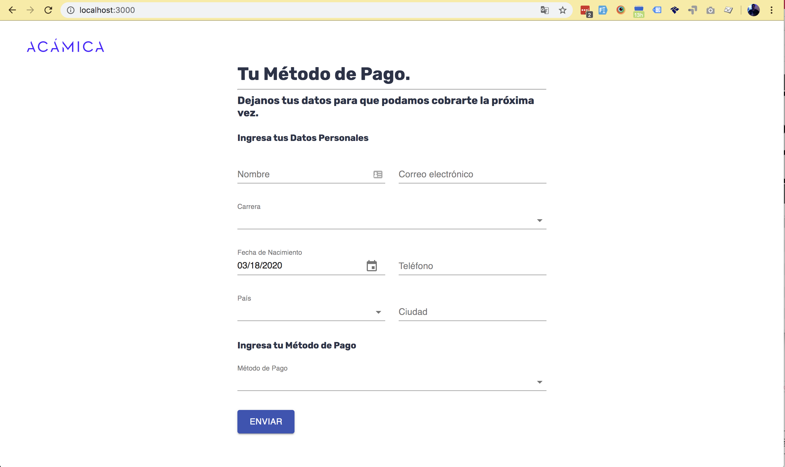
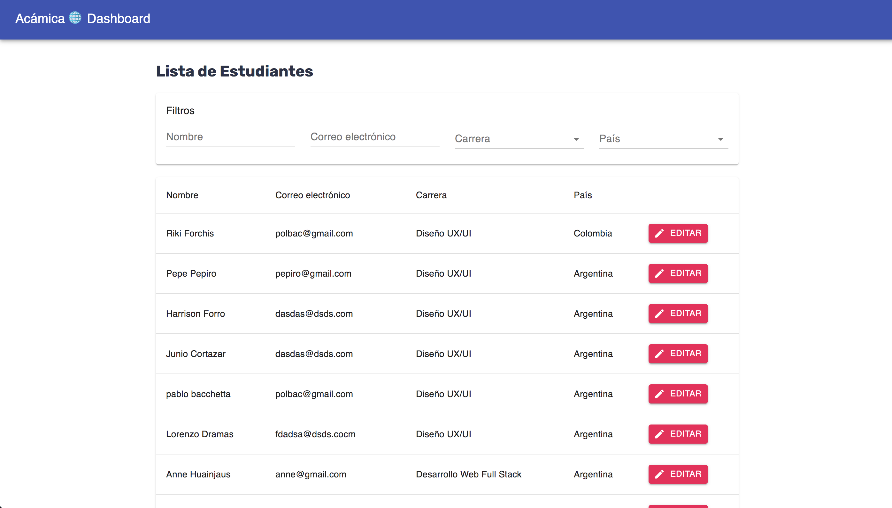

# students

## Intro

A nice tool to create students on a dashbaord

## Previews

Form (Create new Student)


Dashboard (List & Edit Students)


## Requeriments

- node > 10
- yarn

## Install

```
yarn install
```

## Dev

```
yarn run dev
```
## Build

```
yarn run build
yarn run build:production # for production
```

## Start Application

```
yarn run start
yarn run start:production  # for production
```

## Deploy

```
now
```

and next

```
now --prod
```


## Stack

- nextjs
- react
- redux & redux-thunk (only for dashboard)
- typeorm
- material-ui
- yup


## TODO

✅ UI Filters

✅ Botones edit

✅ Date Error

✅ push history

✅ Deploy (funciona intermitente la BD)

✅ Edit / List Server Errors

❌ JWT on other endpoints

❌ Storybook

❌ Theme Context

❌ Docker

❌ Get a new Database Service