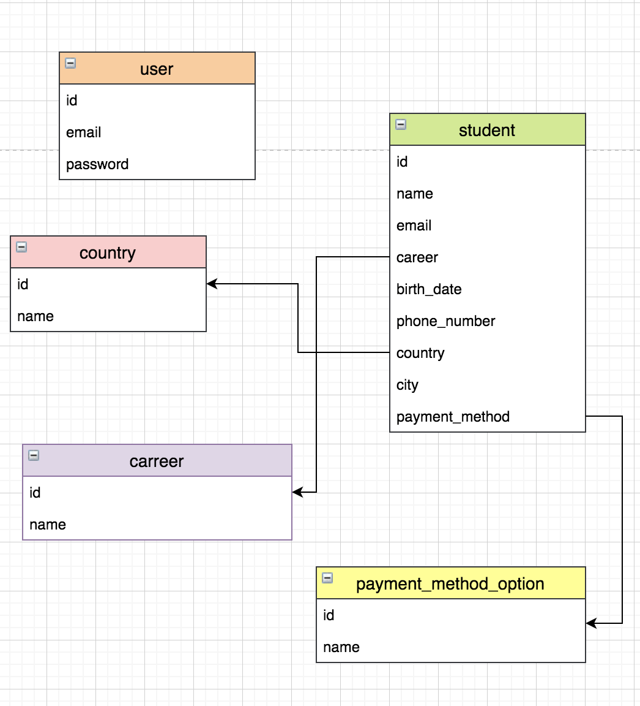

# 🎓students

## Intro

A nice tool to create students on a dashbaord

## Previews

### Form (Create new Student)


### Dashboard (List & Edit Students)


## Requeriments

- node > 10
- yarn

## Install

```
yarn install
```

## Dev

```
yarn run dev
```
## Build

```
yarn run build
yarn run build:dev # for development
```

## Start Application

```
yarn run start
yarn run start:dev # for development
```

## Deploy

```
now
```

and next

```
now --prod
```


## Stack

- nextjs
- react
- formik
- redux & redux-thunk (only for dashboard)
- typeorm
- material-ui
- yup

## Database



https://app.diagrams.net/#G17qvNLYbBx8cw3e-m1sWTnsD1L4eBLZVK

## Global Store (just for Dashboard)

```
{
    session: {
        token: null,
        email: '',
        authorized: false,
        authError: false,
        authServerError: false,
        loading: false
    },
    list: {
        students: [],
        filters: {
            name: '',
            email: '',
            career: null,
            country: null
        },
        serverError: false
    },
    loader: {
        loading: false,
    },
    mainError: {
        error: ''
    },
    edit: {
        student: [],
        careers: [],
        countries: [],
        paymentMethodOptions: [],
    },
    options: {
        careers: [],
        countries: [],
        paymentMethodOptions: [],
    }
}
```

## TODO

✅ UI Filters

✅ Botones edit

✅ Date Error

✅ push history

✅ Deploy (funciona intermitente la BD)

✅ Edit / List Server Errors

✅ Theme Context

✅ Logout

✅ JWT on other endpoints

✅ Error Page

✅ Readme with database

✅ Readme with store

❌ Get a new Database Service

❌ Storybook

❌ Docker

